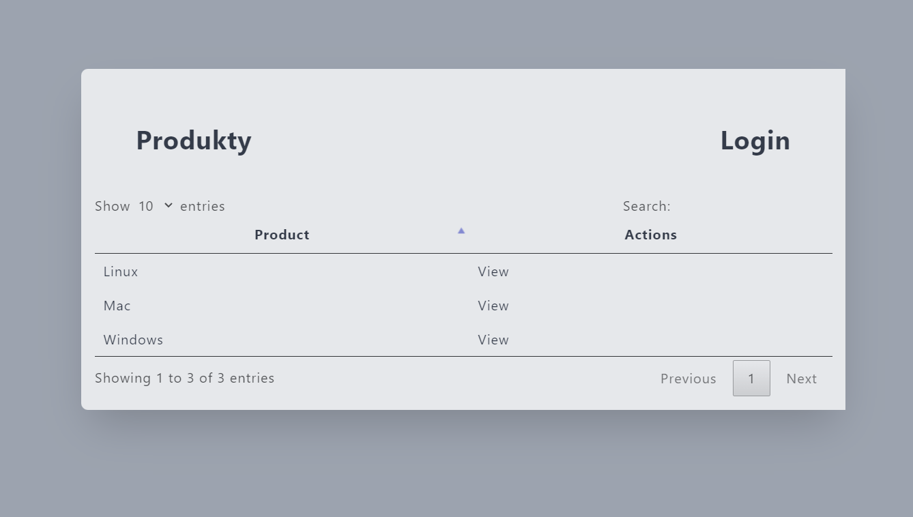
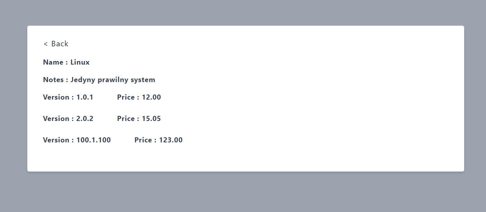
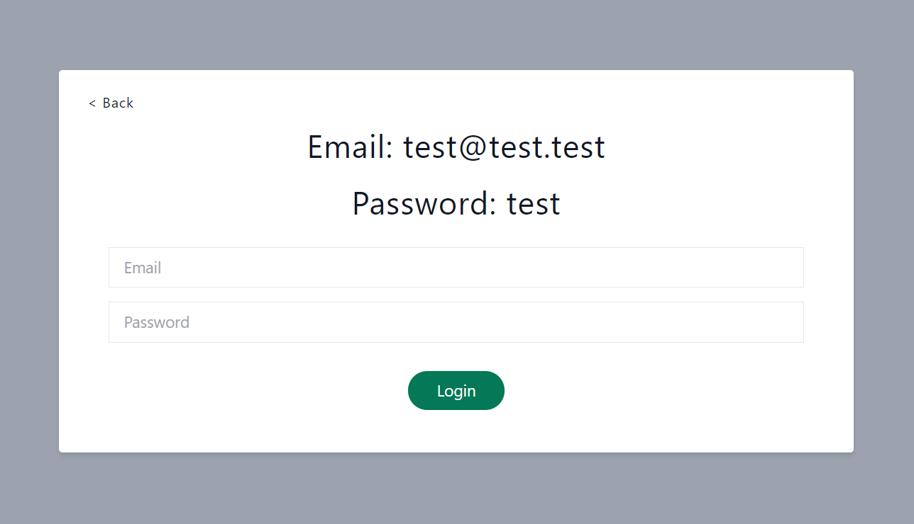
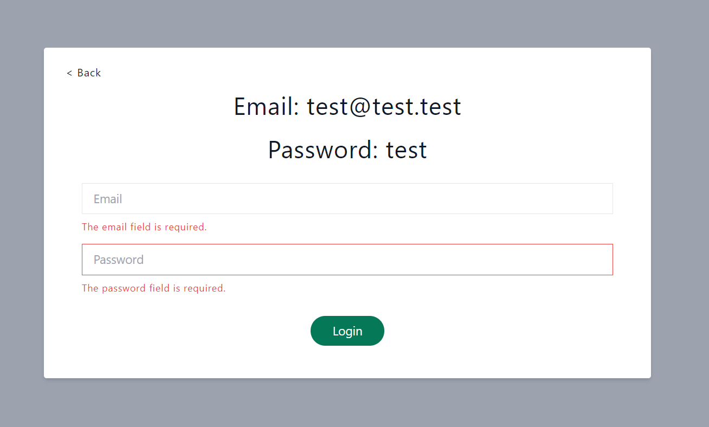
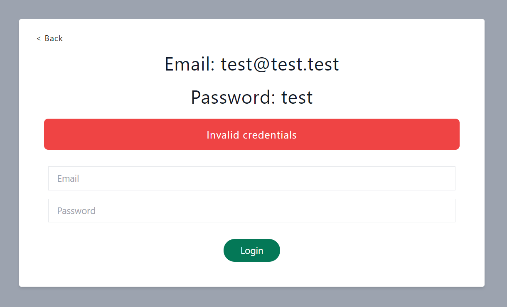
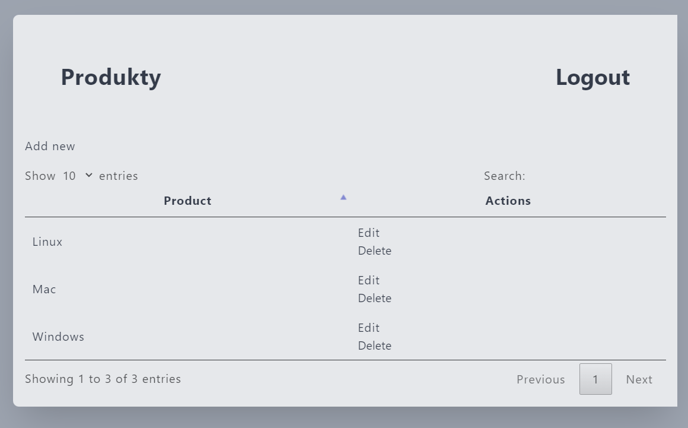
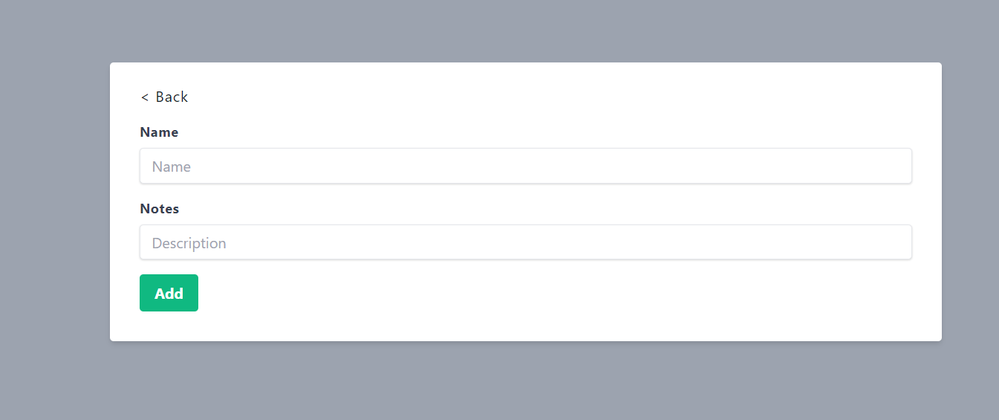
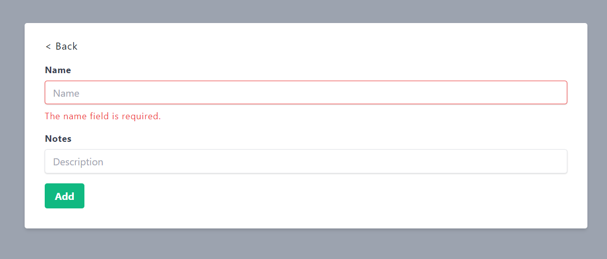
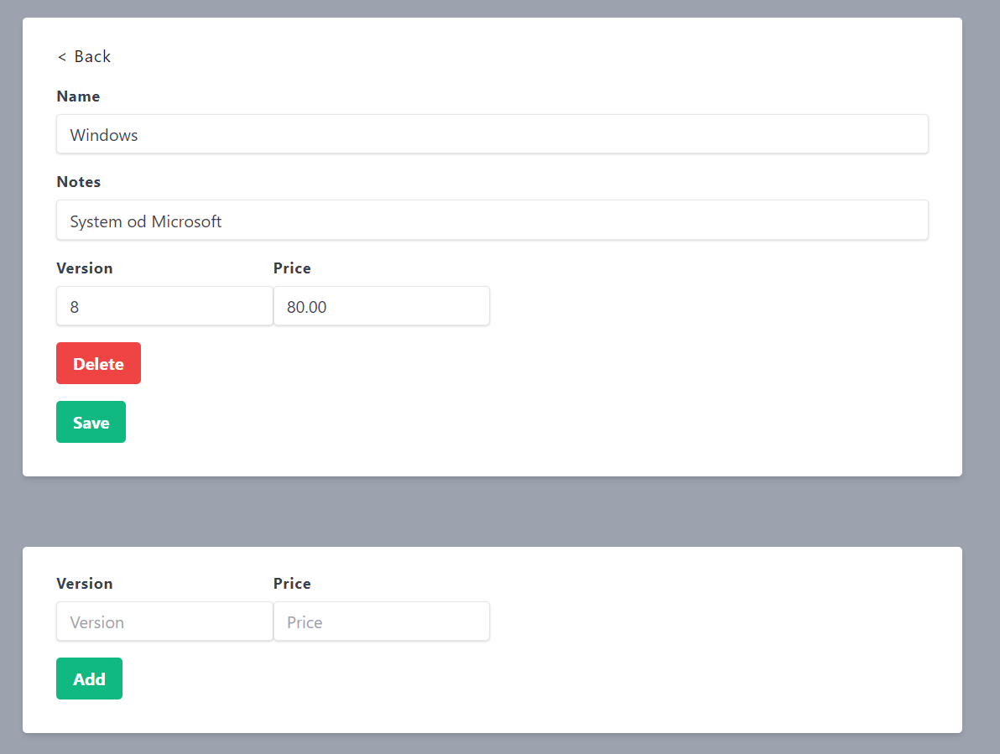

## Create, Read, Update, Delete example app

Guest 

Product view

Product prices view

Login

Login

Product view

Add product

Edit prices

## License

The Laravel framework is open-sourced software licensed under the [MIT license](https://opensource.org/licenses/MIT).
